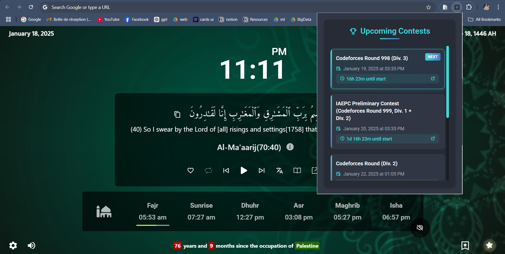

**CF Notifier** is a Chrome extension that helps competitive programmers stay on top of their game. It shows a list of upcoming Codeforces contests quickly and effortlessly, with timely reminders so you never miss a competition.

## Features
- 🗓️ View a list of upcoming Codeforces contests.
- ⏰ Get timely notifications before a contest starts.
- 💡 Lightweight and easy to use.

## Installation
1. Clone or download the repository:
   ```bash
   git clone https://github.com/OussamaBenSlama/CF-Notifier.git
2. Open Chrome and navigate to chrome://extensions/.
3. Enable Developer Mode (toggle it in the top-right corner).
4. Click Load unpacked and select the folder where you cloned/downloaded the project.

## Usage
1. Once installed, click the CF Notifier icon in your browser toolbar.
2. View the upcoming contests and check their details.
3. Receive notifications as contests approach.

## Screenshots
<p align="center">
    
</p>

## License
This project is licensed under the Apache-2.0 license.

## Contributing
Contributions are welcome! If you'd like to improve this extension:
1. Fork the repository.
2. Create a new branch:
   ```bash
   git checkout -b feature-name
3. Commit your changes and push to your branch :
   ```bash
   git commit -m "Add feature: feature-name"
   git push origin feature-name
4. Open a pull request.

## Acknowledgements
Data sourced from Codeforces.


